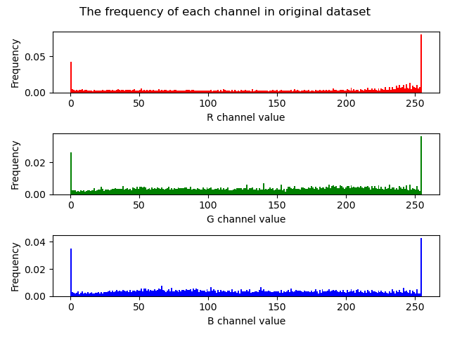
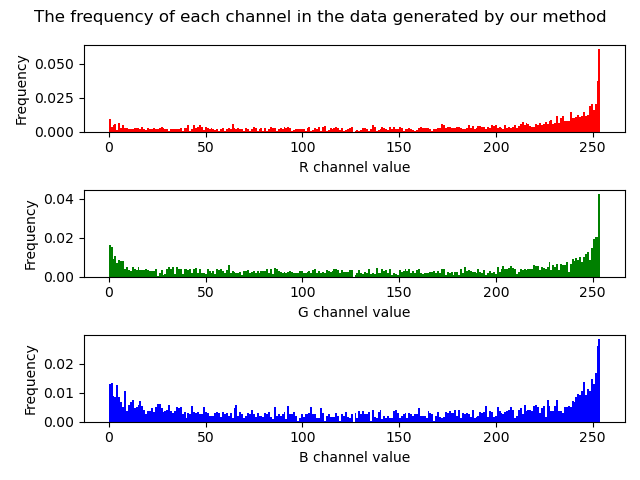

This repo is the implementation of SmartColor method.  
Here are the statistical characteristics of original dataset which is used for training model and the data genenrated by our method.

    

    

